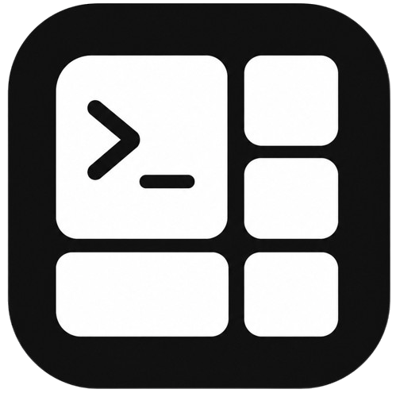
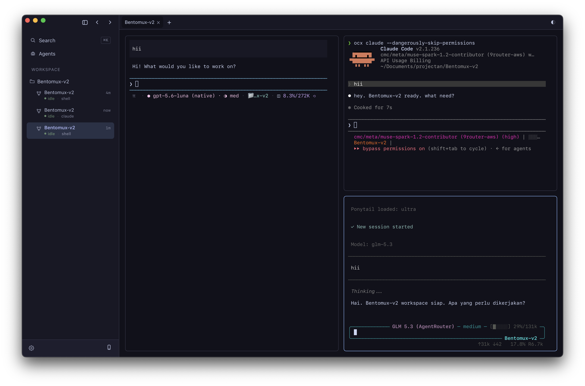

<div align="center">
    
  <h1>Bentomux</h1>
</div>

Calm desktop for AI agent runtime workspaces. Bentomux brings project workspaces, persistent split-pane terminals, Git status, agent configuration, approval requests, and remote monitoring into one native desktop app.

Bentomux v2 is the Tauri 2 port of the original Electron application. The renderer remains vanilla TypeScript; the desktop backend is Rust.



## Features

**Workspaces and terminals**
- Add and remove project folders as workspaces; app state persists in `bentomux.json`
- Real PTY terminals with shell auto-detection and configurable shell selection
- Chrome-style terminal tabs with renameable titles
- Recursive split panes, split right or down, with persisted layouts restored across restarts
- Copy and paste, right-click context menu, clickable URLs, terminal resizing, and hidden scrollbars
- Command palette (`Ctrl+K`) for navigation, terminal panes, and open tabs

**Git**
- Per-workspace branch and file status monitoring
- Changes count in the titlebar
- Read-only Git panel with branch status and changed files
- Full-page per-file diffs with Shiki syntax highlighting
- Push with upstream tracking

**Agent runtimes**
- Detects Claude Code, pi, Qwen CLI, OpenAI Codex, OpenCode, Gemini CLI, Cursor, Kilo Code, and QwenPaw
- Per-agent model settings, base URL, context window, API key, and provider format
- Manage agent memory, skills, and MCP resources from one place
- Native resource toggles with snapshot restore where an agent has no disable flag
- Live idle, working, and blocked status per terminal tab, derived from process and terminal-screen state

**Approvals and remote monitoring**
- Agent permission requests through the bundled hook bridge over Unix sockets or Windows named pipes
- Always-on-top approval overlay with Approve, Deny, and Jump-to-tab actions
- Fail-open behavior: if the bridge is unavailable, the agent falls back to its native prompt
- Optional HTTP/WebSocket remote monitor with QR-code pairing and a persistent access token
- Mirror terminal panes and runtime status to a browser on the local network
- Approve or deny remote permission requests without switching to the desktop

**Settings**
- Light/dark appearance and six palettes: default, Catppuccin, Rosé Pine, Gruvbox, Dracula, and Nord
- Terminal font family and size
- Shell selection for new terminals
- Rebind command-palette and split-pane shortcuts
- Configure remote monitoring, approval overlay size, notification sound, sidebar width, and expanded sections

## Getting started

### Requirements

- Node.js and npm
- Rust and Cargo for the Tauri application
- A supported desktop platform: macOS, Windows, or Linux

### Development

```sh
npm install
npm run tauri dev
```

`npm run dev` starts the Vite frontend only. Use `npm run tauri dev` to run the complete desktop application with the Rust backend.

## Scripts

| Script | What it does |
| --- | --- |
| `npm run dev` | Start the Vite frontend at `http://localhost:5173` |
| `npm run build` | Build the two frontend pages to `out/renderer/` |
| `npm run preview` | Preview the built frontend |
| `npm run typecheck` | Run TypeScript type checking with `tsc --noEmit` |
| `npm run tauri dev` | Run the complete Tauri desktop application |
| `npm run tauri build` | Build distributable Tauri bundles |
| `cargo check --manifest-path src-tauri/Cargo.toml` | Check the Rust backend |

There is currently no configured JavaScript test runner, linter, or formatter.

## Architecture

```
src/                          # Vite frontend root
  index.html                  # Main window entrypoint
  approval.html               # Approval overlay entrypoint
  src/                        # Vanilla TypeScript renderer modules
    views/                    # Terminal, Git, diff, agents, settings, remote, and tabs views
    components/               # Shared UI components
    highlight/                # Shiki syntax highlighting
  shared/                     # Types and split-tree logic shared with Rust
  preload/                    # Legacy type stubs retained for compatibility
src-tauri/
  src/                        # Rust Tauri backend
    state.rs                  # Persisted application state
    commands.rs               # Renderer-to-backend Tauri commands
    pty.rs                    # PTY session management
    git.rs                    # Git watching and operations
    runtime.rs                # Process polling and runtime status
    bridge.rs                 # Agent approval bridge
    overlay.rs                # Approval overlay window management
    remote.rs                 # HTTP/WebSocket remote monitor
    agents/                   # Agent integrations and resource management
    detect/                   # Screen parsing and manifest rules
  capabilities/default.json  # Window and event permissions
  tauri.conf.json             # Tauri windows, bundles, and resources
resources/
  bentomux-hook.cjs            # Agent hook CLI
  remote-page.html             # Remote monitor page
vite.config.ts                # Two-page Vite build configuration
```

The renderer communicates with Rust through Tauri `invoke()` commands and `listen()` events. Rust owns PTYs, Git watching, persisted state, runtime detection, approval handling, and the remote monitor. Persisted state stays compatible with the existing Bentomux JSON format and uses camelCase keys.

## Building

```sh
npm run build
npm run tauri build
```

Tauri bundles macOS (`dmg`, `app`), Windows (`nsis`, `msi`), and Linux targets supported by the local toolchain. The agent hook and remote monitor page are bundled as application resources.

## Development notes

- Work in this repository only; the original Electron application is in the sibling `../Bentomux/` directory.
- `out/renderer/` is generated build output and is not source code.
- The frontend is intentionally kept close to the Electron version while backend responsibilities migrate to Rust.
- Persisted state must remain camelCase so existing `bentomux.json` files continue to load correctly.

## License

MIT — see [LICENSE](LICENSE).
